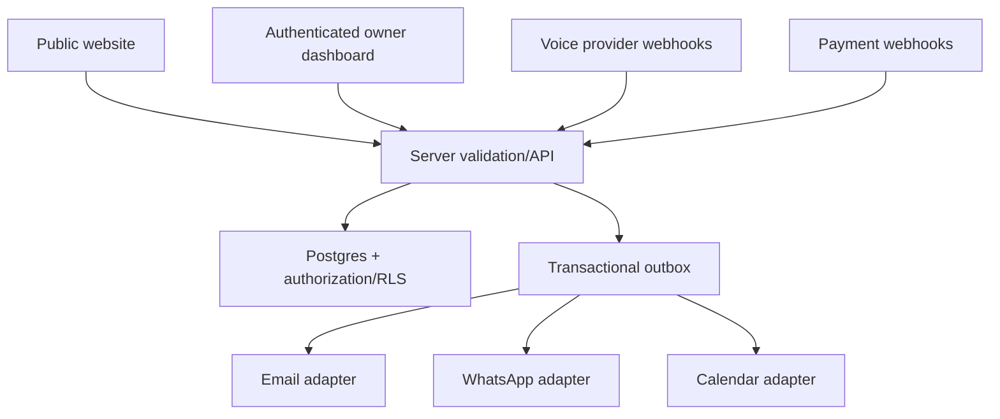

# Architecture, Owner CRM, Booking, and Integrations

## Architecture decision process

Do not lock an exact framework version in this pack. At P1, compare the existing repository against current stable supported options. Default shape if no adequate app exists:



Recommended capability baseline:

- server-rendered React framework with TypeScript strict;
- Postgres-class relational database with migrations, point-in-time/backup strategy, and row-level or equivalent authorization;
- managed auth with secure session rotation, recovery, MFA/passkey path, and server-side role checks;
- background/outbox processing for email/WhatsApp/calendar/payment side effects;
- privacy-conscious analytics and error monitoring approved at G1/G4;
- deploy provider with preview builds, encrypted environment values, logs, rollback, and custom domain.

Use Supabase only if approved after current research or if the repository already uses it well. Do not add Firebase and Supabase together without a demonstrated need.

## Public versus private surfaces

| Surface | Public data | Private data | Access |
|---|---|---|---|
| Marketing pages | Approved content, prices, case-study claims | none | public |
| Audit/service selector | Questions and visitor-entered data in transit | inquiry data after submit | public write through validated endpoint |
| Booking request | Approved availability hints if any | contact details, notes, provider IDs | public write; private read |
| Customer acknowledgement | minimal submitted summary | no internal notes | signed/ephemeral or email only |
| Owner CRM | none | leads, contacts, activity, tasks, bookings, notification status | authenticated authorized owner |
| Provider webhooks | none | signed events and provider IDs | server-only verified endpoint |
| Admin settings | none | templates, pricing rules, integrations, retention | owner only |

Public bundles may contain public content and UI state definitions. They must not contain secrets, lead lists, admin queries, internal pricing logic, unpublished content, raw provider payloads, service-role credentials, or customer data.

## Core data model

Exact types and constraints are finalized in P2. Minimum entities:

| Entity | Purpose | Critical controls |
|---|---|---|
| `users` / auth identity | owner/admin identity | managed auth, MFA, no public read |
| `memberships` | roles and tenant/workspace | server authorization, unique constraints |
| `contacts` | deduplicated people/businesses | normalized email/phone, consent, deletion |
| `inquiries` | immutable first conversion record | source, intent, market, status, consent snapshot |
| `inquiry_answers` | flexible questionnaire answers | allowlisted question keys, retention |
| `service_selections` | chosen outcome/scope | versioned service catalogue |
| `appointments` | requested/confirmed/cancelled slots | provider source, timezone, status machine |
| `pipeline_stages` | controlled CRM stages | version/order, no free-text stage drift |
| `opportunities` | deal/lead ownership and value | value optional until verified, owner, next action |
| `tasks` | follow-ups and operational work | due time, owner, completion/audit |
| `activities` | append-only timeline | actor, event type, safe metadata |
| `notes` | private owner notes | sanitized, access controlled |
| `consents` | channel/purpose/source/timestamp | append-only evidence, revoke status |
| `suppression` | opt-out and do-not-contact | checked before every non-service send |
| `notifications` | intended owner/customer messages | template version, recipient ref, minimal payload |
| `outbox_events` | durable external side effects | idempotency, attempts, next retry, status |
| `provider_events` | webhook receipts | unique provider event ID, signature result |
| `dead_letters` | exhausted side effects | safe replay, reason, operator action |
| `content_items` | approved pages/articles/case studies | draft/approved/published states |
| `claims` | every public factual claim | evidence, approver, expiry/review date |
| `assets` | image/video/3D ownership | license, use scope, attribution, variants |
| `offers` / `price_versions` | market/scope pricing | approval, effective dates, exclusions |
| `audit_logs` | sensitive/admin actions | append-only, redacted, retention |

Single-owner launch does not require complex multi-tenancy. Still isolate future tenant identifiers if the approved product roadmap demands it; do not build a fleet or SaaS tenancy prematurely.

## State machines

### Inquiry

```text
received → qualified | needs_information | unsuitable
qualified → consultation_requested | proposal_pending | closed
any active → spam | withdrawn | archived
```

### Appointment

```text
requested → checking_availability → confirmed
requested/checking → needs_alternative | provider_failed
confirmed → completed | cancelled | rescheduled | no_show
```

Only provider/owner confirmation can move to `confirmed`. Form submission alone cannot.

### Notification

```text
queued → processing → accepted_by_provider → delivered
processing/accepted → retry_scheduled → dead_letter
any queued state → suppressed | cancelled
```

Do not label `accepted_by_provider` as delivered.

## Owner CRM/dashboard launch scope

### Required

1. Secure owner login, logout, recovery, MFA setup/status, session revocation.
2. Dashboard: new inquiries, due follow-ups, requested appointments, provider failures, dead letters.
3. Lead pipeline: filter/search/sort, stage, owner, next action, source, market, service.
4. Lead detail: contact, answers, selected service, consent, timeline, notes, tasks, bookings, notifications.
5. Booking queue: requested, confirmed, alternative needed, cancelled, completed, timezone-safe display.
6. Task/follow-up view: due/overdue/today/completed; bulk external sending excluded at launch.
7. Notification center: email/WhatsApp attempt and delivery state, safe retry, reason.
8. Content/proof status: pending claims/assets/provider proofs before publication.
9. Settings: approved public contact, hours, services, price versions, provider connection status—not raw secrets.
10. Audit log, export, deletion/anonymization workflow, and retention status.

### Later

Forecasting, AI call coaching, complex attribution, multi-client/tenant billing, autonomous campaigns, team quotas, agent fleets, advanced BI, and full finance operations are later modules. Link to existing Revenue Command rather than duplicating all finance into the first website.

## Inquiry/booking notifications

Owner email and WhatsApp should contain:

- new inquiry/booking request ID;
- name/business and masked contact where possible;
- selected service/outcome;
- requested slot/timezone and current status;
- urgency/source;
- secure dashboard link;
- no full sensitive questionnaire or internal notes.

Customer acknowledgement states exactly what happened and what happens next. If booking is not confirmed: “Your request was received; we will confirm the slot.”

## Integration adapter contract

Every email, WhatsApp, voice, calendar, and payment adapter implements:

```ts
type ProviderResult = {
  accepted: boolean;
  providerEventId?: string;
  status: 'accepted' | 'delivered' | 'failed' | 'unknown';
  retryable: boolean;
  safeErrorCode?: string;
};
```

All requests use server-only credentials, timeout, schema validation, idempotency key, redacted logs, metrics, and a test double. Provider-specific payloads do not leak into core business logic.

## Payment boundary

Payments are not automatically part of launch. Enable only for a fixed, clearly described offer with approved price, cancellation/refund terms, adult/legal-owner KYC, and tax review.

Use hosted checkout where appropriate. Create the order server-side from the approved price version; never trust browser-supplied amount/currency. Verify webhook signatures and order state. Reconcile provider records to internal records. Do not store card data.

